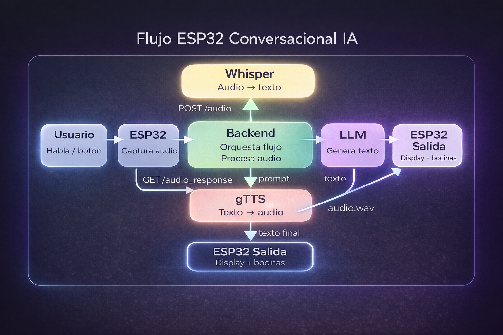
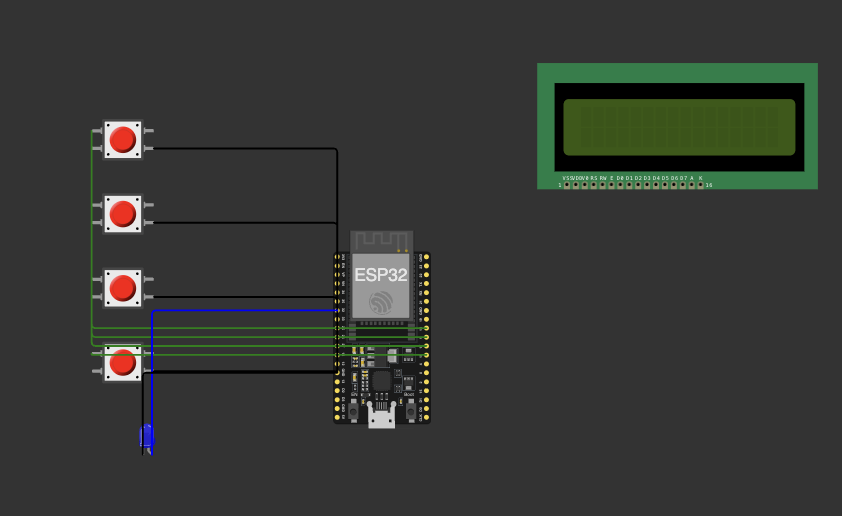

# ESP32 Gestor de IA con audio, display y control por botones

**Escuela:** UNITEC Campus Sur  
**Miembro del equipo:** Gael Ledesma Caballero  
**Materia:** Sistemas Inteligentes  
**Actividad:** Proyecto final  
**Maestro:** Miguel Angel Aguilar Cruz

## Descripción general del proyecto

> **Proyecto integrador de hardware + IA + procesamiento de audio en tiempo real.**

Este proyecto consiste en el desarrollo de un dispositivo físico basado en **ESP32** que funciona como una interfaz de interacción con un sistema de inteligencia artificial. La idea principal es que el usuario pueda comunicarse con el sistema mediante **voz**, recibir una respuesta en **audio reproducido por bocina**, y al mismo tiempo visualizar información importante en un **display LED matricial**.

El ESP32 actúa como el componente central del sistema embebido. A través de sus botones físicos, el usuario puede iniciar acciones como grabar audio, reproducir nuevamente la última respuesta y cancelar una reproducción en curso. Esta interacción hace que el dispositivo sea más natural de usar, ya que no depende únicamente de una interfaz gráfica tradicional.

De manera general, el flujo del proyecto es el siguiente:

- El usuario presiona un **botón** para comenzar a grabar.
- El ESP32 captura **audio** desde un micrófono conectado por **I2S**.
- El dispositivo envía ese audio a un **sistema externo (backend)** que procesa la información.
- Después, el ESP32 recibe la **respuesta generada** y la presenta de dos maneras:
  - mediante texto mostrado en el display,
  - y mediante audio reproducido en una bocina.
- El usuario también puede repetir la última respuesta o cancelar la reproducción usando botones dedicados.

Este enfoque combina elementos de **hardware**, **comunicación en red**, **procesamiento de audio** y **automatización de interacción con IA**, lo que lo convierte en un proyecto integrador dentro del contexto de la materia.

> Más adelante se agregarán diagramas de arquitectura, flujo y conexiones para complementar esta explicación.

## Diagrama general del sistema



---

## Carpeta `esp32`

La carpeta `esp32` contiene la parte correspondiente al firmware del dispositivo. Aquí se encuentra el código necesario para que el ESP32 controle el micrófono, la bocina, el display y los botones físicos, además de la comunicación básica con el sistema externo.

## Diagrama del módulo ESP32



Su propósito principal es convertir al ESP32 en un módulo de interacción física capaz de:

- capturar audio del usuario,
- mostrar mensajes en un display,
- reproducir respuestas en una bocina,
- y reaccionar a eventos mediante botones.

### ¿Qué resuelve esta carpeta?

La carpeta `esp32` concentra toda la lógica del dispositivo embebido. En otras palabras, aquí se programa cómo se comporta el hardware frente a las acciones del usuario. Gracias a esta parte del proyecto, el sistema puede funcionar como un asistente físico y no solo como una aplicación aislada.

### Estructura general de la carpeta

Dentro de esta carpeta se organizan varios archivos con responsabilidades específicas. Esta separación ayuda a que el código sea más claro, más fácil de mantener y más sencillo de ampliar en el futuro.

#### `main.ino`

Es el archivo principal del programa del ESP32. Aquí se define el flujo general del dispositivo, incluyendo:

- la inicialización del sistema,
- la configuración de botones,
- la conexión a la red WiFi,
- la captura de audio,
- la solicitud de procesamiento,
- la obtención de respuestas,
- y el control general de reproducción y visualización.

En términos prácticos, este archivo coordina el comportamiento completo del dispositivo.

#### `audio_manager.h`

Este archivo se encarga del manejo de audio de salida. Su responsabilidad es preparar y utilizar la interfaz I2S para reproducir la respuesta del sistema mediante una bocina o amplificador compatible.

Aquí se controla principalmente:

- la configuración del modo de reproducción,
- la recepción del flujo de audio,
- y la reproducción del contenido recibido.

#### `display_manager.h`

Este archivo concentra la lógica del display LED matricial. Su función es mostrar texto útil para el usuario, como estados del sistema, mensajes cortos o respuestas resumidas.

Entre sus objetivos se encuentran:

- inicializar el display,
- limpiar el contenido mostrado,
- actualizar mensajes,
- y mantener la animación o desplazamiento del texto cuando sea necesario.

#### `network_manager.h`

Este archivo agrupa la parte relacionada con la comunicación básica en red desde el ESP32. Su función es facilitar la obtención de respuestas desde el sistema remoto y organizar el procesamiento del texto que se recibe.

Esto permite que la lógica de comunicación quede separada del resto del control del dispositivo.

---

## Funcionalidades principales del módulo ESP32

A nivel general, la carpeta `esp32` permite que el dispositivo realice las siguientes tareas:

### 1. Captura de audio

El sistema usa un micrófono conectado por I2S para registrar la voz del usuario. Esta entrada de audio es la base de la interacción, ya que permite enviar consultas habladas al sistema.

### 2. Control por botones

El proyecto utiliza botones físicos para ejecutar acciones concretas. Esto aporta una interacción directa con el hardware y evita depender de interfaces más complejas.

Actualmente, el diseño considera botones para:

- grabar audio,
- reproducir nuevamente la última respuesta,
- y cancelar la reproducción en curso.

### 3. Visualización en display

El dispositivo muestra mensajes en un display LED matricial, lo que ayuda a que el usuario conozca el estado actual del sistema. Por ejemplo, puede saber si el dispositivo está escuchando, procesando o mostrando una respuesta.

### 4. Reproducción de audio

Una vez que el sistema obtiene una respuesta, esta puede reproducirse en una bocina. Esto convierte al proyecto en una interfaz mucho más natural, ya que el usuario no solo ve información, sino que también la escucha.

### 5. Coordinación entre modos de entrada y salida

El firmware debe alternar correctamente entre el uso del micrófono y la reproducción de audio, evitando conflictos en el manejo de I2S. Esta coordinación es importante para que el dispositivo funcione de forma estable.

---

## Enfoque de diseño

La parte del ESP32 fue planteada con una estructura modular. En vez de colocar toda la lógica en un solo archivo, se dividieron responsabilidades por componente. Esto tiene varias ventajas:

- mejora la legibilidad del proyecto,
- facilita la depuración,
- permite hacer cambios sin afectar todo el sistema,
- y prepara mejor el código para futuras mejoras.

También se buscó que la interacción del usuario fuera lo más directa posible: presionar un botón, hablar, esperar procesamiento y recibir una respuesta tanto visual como auditiva.

---

---

## Carpeta `frontend`

La carpeta `frontend` contiene la interfaz de usuario del sistema. Esta parte del proyecto permite visualizar la información generada por el backend y facilita la interacción desde un navegador web.

Aunque el ESP32 es el principal medio de interacción física, el frontend funciona como una herramienta complementaria para monitorear, probar y extender el sistema.

### ¿Qué hace el frontend?

El frontend se conecta al backend y permite:

- visualizar respuestas generadas por la IA,
- mostrar texto procesado,
- interactuar con el sistema sin necesidad del ESP32,
- y facilitar pruebas durante el desarrollo.

### Tecnologías utilizadas

El frontend está desarrollado con tecnologías web modernas:

- **HTML, CSS y JavaScript**
- **Vite** como herramienta de desarrollo
- **Frameworks (opcional)** como React (dependiendo de la implementación)

### Flujo de uso

El flujo típico del frontend es:

1. El usuario accede a la aplicación desde el navegador.
2. Se realiza una conexión con el backend.
3. El frontend puede:
   - enviar solicitudes,
   - recibir respuestas,
   - y actualizar la interfaz en tiempo real.
4. La información se muestra de forma visual para el usuario.

### Relación con el sistema

El frontend no es obligatorio para el funcionamiento del dispositivo ESP32, pero aporta varias ventajas:

- facilita la depuración del sistema,
- permite visualizar respuestas sin depender del hardware,
- y abre la posibilidad de escalar el proyecto a una aplicación más completa.

### Enfoque de diseño

El frontend está pensado como una capa ligera y flexible. No concentra lógica compleja, ya que la mayor parte del procesamiento ocurre en el backend.

Su objetivo principal es servir como interfaz visual del sistema.

---

## Alcance actual de esta documentación

---

## Carpeta `backend`

La carpeta `backend` contiene el sistema encargado de procesar la información enviada por el ESP32. Aquí es donde ocurre la mayor parte de la lógica inteligente del proyecto, incluyendo el reconocimiento de voz, la interacción con el modelo de inteligencia artificial y la generación de audio de respuesta.

A diferencia del módulo ESP32, que se enfoca en la interacción física, el backend funciona como el “cerebro” del sistema.

### ¿Qué hace el backend?

El backend recibe datos de audio desde el ESP32, los interpreta y genera una respuesta adecuada. Este proceso incluye varias etapas:

- Conversión de audio a texto (speech-to-text).
- Interpretación del mensaje del usuario.
- Generación de respuesta mediante un modelo de IA.
- Generación de audio (text-to-speech).
- Envío de la respuesta al ESP32.

### Tecnologías utilizadas

El backend está desarrollado en Python y utiliza las siguientes herramientas principales:

- **Flask:** para crear el servidor HTTP.
- **Flask-SocketIO:** para comunicación en tiempo real con el ESP32.
- **Whisper:** para transcripción de audio a texto.
- **Ollama (modelo local):** para generar respuestas inteligentes.
- **gTTS:** para convertir texto en audio.
- **FFmpeg:** para convertir archivos de audio a formato compatible con el ESP32.

### Flujo de funcionamiento

El funcionamiento general del backend es el siguiente:

1. El ESP32 envía fragmentos de audio al endpoint `/audio`.
2. Cuando termina de grabar, el ESP32 llama a `/finalizar`.
3. El backend une todos los fragmentos de audio y los procesa.
4. Se transcribe el audio usando Whisper.
5. Dependiendo del contenido:
   - Se activa un modo especial (como base de conocimiento), o
   - Se envía el texto a un modelo de IA.
6. Se genera una respuesta en texto.
7. Esa respuesta se convierte en audio.
8. El archivo de audio final se guarda y queda disponible en `/audio_response`.
9. El ESP32 consulta ese endpoint y reproduce el audio.

### Modo base de conocimiento

El sistema incluye un modo especial activado por voz mediante la frase:

```
**"modo conocimiento"**
```

En este modo, el backend utiliza una base de conocimiento inspirada en relaciones de personajes (tipo lógica estilo Prolog). El sistema puede:

- identificar nombres incluso con errores de pronunciación,
- normalizar palabras similares,
- y encontrar relaciones entre entidades.

Ejemplo:

- Usuario: “Harry y Hermione”
- Respuesta: “Harry y Hermione: amigos”

Este modo permite demostrar lógica simbólica dentro del proyecto.

### Generación de audio

Para evitar errores de sincronización con el ESP32, el backend utiliza una estrategia robusta:

- Genera archivos temporales (`response_tmp_*.mp3` y `.wav`).
- Convierte el audio usando FFmpeg.
- Valida que el archivo WAV sea correcto.
- Reemplaza el archivo final de forma atómica (`response.wav`).

Esto garantiza que el ESP32 nunca lea un archivo incompleto.

### Comunicación con el ESP32

El backend expone endpoints clave:

- `/audio` → recibe audio en chunks.
- `/finalizar` → inicia el procesamiento.
- `/audio_response` → devuelve el audio final.
- `/ultima_respuesta` → devuelve la última respuesta en texto.

Además, usa WebSockets para enviar respuestas en tiempo real.

### Enfoque de diseño

El backend fue diseñado con enfoque en:

- robustez (manejo de errores y tiempos de espera),
- tolerancia a fallos (archivos temporales y validaciones),
- y claridad en el flujo de procesamiento.

Esto permite que el sistema funcione de forma estable incluso en condiciones no ideales de red o procesamiento.

---

## Alcance actual

---

Con esta sección, el README ahora documenta:

- la carpeta `esp32` (**interacción física**),
- la carpeta `backend` (**procesamiento inteligente**),
- la carpeta `frontend` (**interfaz visual del sistema**).

En futuras versiones se añadirán diagramas completos de arquitectura y flujo del sistema.
